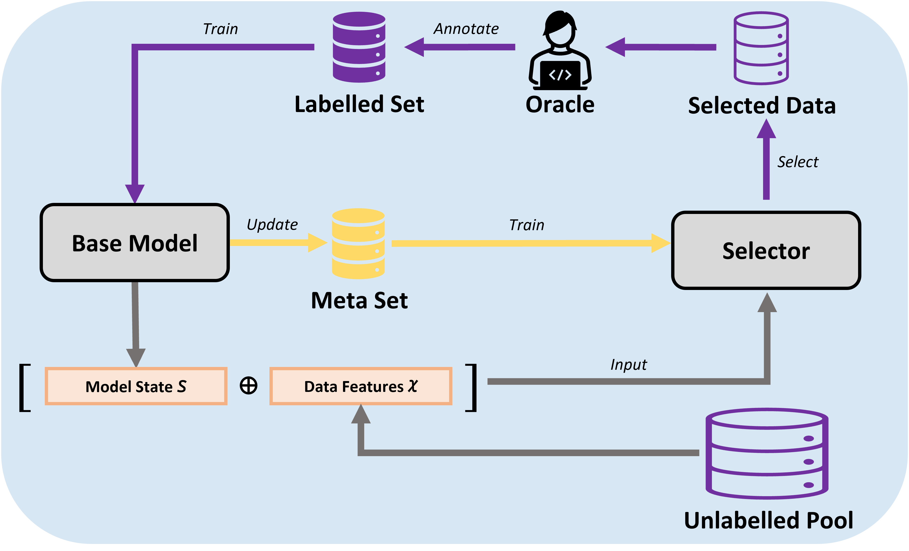

# Online Meta-Active Learning for Regression

This repository contains code accompanying our project "Learning to Learn Gradient Norms for Improved Active Learning in Science and Technology". 

## OMAL
<p align="center">
  
</p>

Our method OMAL is described as the above pipeline and can be accessed in: \AL_methods\OMAL 


## License
This source code is licensed under the Apache 2.0 license.


## Dependencies

The latest tested versions of the dependencies are listed:
- numpy                     1.23.5
- scipy                     1.9.1
- scikit-learn              1.3.0 
- pandas                    1.4.4
- torch                     2.0.0+cu118
- skorch                    0.13.0
- modal                     0.4.1


## Code Structure

The code is structured as follows:
- Seeds: A set of shared seeds among different datasets for the reproducible results.
- Data_Processing: The processing code for each dataset.
- Datasets: Raw data for each dataset.
- Results: The folder to save the experimental results, and you need to create the subfolders by your way.
- AL_methods:
  - Greedy: The Greedy method proposed by Wu, Lin and Huang (2019). We used the pool-based iGS here.
  - LCMD: The Largest Cluster Maximum Distance Method, proposed by Holzm{\"u}ller, Zaverkin, K{\"a}stner and Steinwart (2023).
  - QBC: The Query-By-Committee method, proposed by RayChaudhuri and Hamey (1995).
  - Random: Random Sampling.
  - OMAL: The proposed method.

## Datasets

The datasets used in this study are all publicly available, and we have put their raw data into the Datasets folder. The citations of the datasets are listed at the end of the page.


## LCMD

- This repository contains the implementation of the comparison method LCMD method (version 3) from https://github.com/dholzmueller/bmdal_reg with the DOI number: 10.18419/darus-807

- License: This source code is licensed under the Apache 2.0 license. However, the implementation of the acs-rf-hyper kernel transformation in `bmdal/features.py` is adapted from the source code at [https://github.com/rpinsler/active-bayesian-coresets](https://github.com/rpinsler/active-bayesian-coresets), which comes with its own (non-commercial) license. Please respect this license when using the acs-rf-hyper transformation directly from `bmdal/features.py` or indirectly through the interface provided at `bmdal/algorithms.py`.


## Citations

```bibtex
@misc{efron2004least,
  title={Diabetes Data},
  author={Efron, Bradley and Hastie, Trevor and Johnstone, Iain and Tibshirani, Robert},
  howpublished = {\url{https://www4.stat.ncsu.edu/~boos/var.select/diabetes.tab.txt}},
  year={2004}
}

@misc{Cortez:2009,
  author = {Cortez, Paulo and Cerdeira, Ant{\'o}nio and Almeida, Fernando and Matos, Telmo and Reis, Jos{\'e}},
  title = {Wine Quality},
  howpublished={\url{https://archive.ics.uci.edu/ml/datasets/wine+quality}},
  year = {2009}
}

@article{barnard2017silver,
  title={Silver Nanoparticle Data Set. v3. CSIRO. Data Collection},
  author={Barnard, Amanda and Sun, Baichuan and Motevalli Soumehsaraei, Benyamin and Opletal, George},
  url = {https://doi.org/10.25919/5d22d20bc543e},
  year={2017}
}

@misc{Ross:1993,
  author = {Ross, Quinlan},
  title = {{Auto MPG}},
  howpublished= {\url{https://archive.ics.uci.edu/ml/datasets/auto+mpg}},
  year = {1993}
}

@misc{Magne:2004,
author = {Magne, Aldrin},
title = {{NO2}},
howpublished= {\url{http://lib.stat.cmu.edu/datasets/NO2.dat}},
year = 2004
}

@article{barnard2019neutral,
  title={Periodic Graphene Oxide Data Set. v1. CSIRO. Data Collection},
  author={Barnard, Amanda and Motevalli Soumehsaraei, Benyamin and Sun, Baichuan},
  year={2019},
  url={https://doi.org/10.25919/5e30b45f9852c}
}

@inproceedings{raychaudhuri1995minimisation,
  title={Minimisation of data collection by active learning},
  author={RayChaudhuri, Tirthankar and Hamey, Leonard GC},
  booktitle={Proceedings of ICNN'95-International Conference on Neural Networks},
  volume={3},
  pages={1338--1341},
  year={1995},
  organization={IEEE}
}

@article{wu2019active,
  title={Active learning for regression using greedy sampling},
  author={Wu, Dongrui and Lin, Chin-Teng and Huang, Jian},
  journal={Information Sciences},
  volume={474},
  pages={90--105},
  year={2019},
  publisher={Elsevier}
}

@article{holzmuller2023framework,
  title={A framework and benchmark for deep batch active learning for regression},
  author={Holzm{\"u}ller, David and Zaverkin, Viktor and K{\"a}stner, Johannes and Steinwart, Ingo},
  journal={Journal of Machine Learning Research},
  volume={24},
  number={164},
  pages={1--81},
  year={2023}
}


```